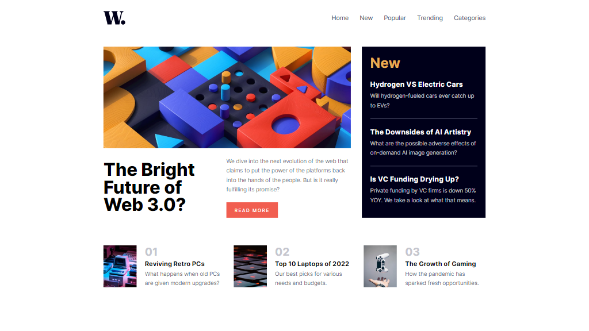

# Frontend Mentor - News homepage solution

This is a solution to the [News homepage challenge on Frontend Mentor](https://www.frontendmentor.io/challenges/news-homepage-H6SWTa1MFl). Frontend Mentor challenges help you improve your coding skills by building realistic projects. 

## Table of contents

- [Overview](#overview)
  - [The challenge](#the-challenge)
  - [Screenshot](#screenshot)
  - [Links](#links)
- [My process](#my-process)
  - [Built with](#built-with)
  - [Useful resources](#useful-resources)
- [Author](#author)
- [donate](#donate)

## Overview

### The challenge

Users should be able to:

- View the optimal layout for the interface depending on their device's screen size
- See hover and focus states for all interactive elements on the page

### Screenshot

### Links

- Solution URL: [https://github.com/rafaeldevvv/frontendmentor-news-homepage](https://github.com/rafaeldevvv/frontendmentor-news-homepage)
- Live Site URL: [https://rafaeldevvv.github.io/frontendmentor-news-homepage/](https://rafaeldevvv.github.io/frontendmentor-news-homepage/)

## My process

### Built with

- Semantic HTML5 markup
- CSS custom properties
- Flexbox
- CSS Grid
- Mobile-first workflow

### Useful resources

- [using CSS Transitions](https://developer.mozilla.org/en-US/docs/Web/CSS/CSS_transitions/Using_CSS_transitions)
- [@starting-style](https://developer.mozilla.org/en-US/docs/Web/CSS/@starting-style#browser_compatibility)
- [HTML Validator](https://validator.w3.org/nu/#textarea)

## Author

The name's Rafael Maia. You can find me on [Instagram](https://www.instagram.com/rafaeldevvv), [X](https://www.twitter.com/rafaeldevvv), and [Linkedin](https://www.linkedin.com/in/rafael-maia-b69662263). Or you can send me an email [rafaeldeveloperr@gmail.com](mailto:rafaeldeveloperr@gmail.com).

I am a freelancer, so you can also find me on [Fiverr](https://www.fiverr.com/rafael787) and [Upwork](https://www.upwork.com/freelancers/~01a4dc9692c96839dc).

## Donate

Also, if you liked this project, consider [buying me a coffee](https://www.buymeacoffee.com/rafael.maia) ☕.
